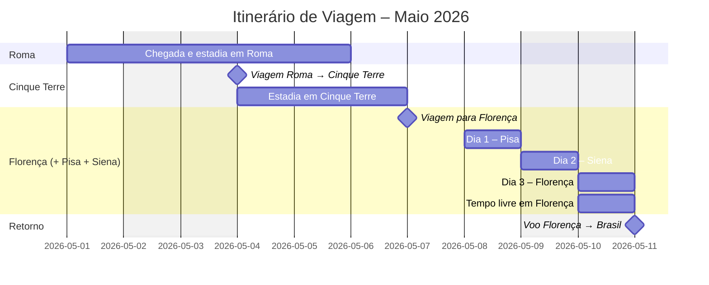

# 🧳 Planejamento de Viagem — Férias 2026

## 🇮🇹 Destinos na Itália

- Roma
- Cinque Terre
- Florença
- Pisa
- Siena

---

# 📅 Itinerário — Versão 1 (3 destinos principais)
**Período:** *01/05/2026 a 11/05/2026*  
**Duração:** *10 noites*

---

## 🗓️ Linha do tempo da viagem

---

## ✈️ Detalhamento dos deslocamentos

### 1️⃣ Brasil → Roma
- **Saída (GRU):** 01/05/2026 — 00:30  
- **Chegada (FCO):** 01/05/2026 — 18:45  

### 2️⃣ Roma → Cinque Terre
- **Saída:** 04/05/2026 — Estação Termini  
- **Chegada:** 04/05/2026 — La Spezia  

### 3️⃣ Cinque Terre → Florença
- **Saída:** 07/05/2026  
- **Programação:**  
  - *08/05 – Pisa*  
  - *09/05 – Siena*  
  - *10/05 – Florença*  
  - *11/05 (metade do dia) – Florença*  

### 4️⃣ Florença → Brasil
- **Saída (FLR):** 11/05/2026 — 19:15  
- **Chegada (GRU):** 11/05/2026 — 05:50  

---

## 🗺️ Fluxo geral do roteiro

---

# 💰 Budget – Versão inicial

| Trecho | Valor |
|--------|-------|
| ✈️ GRU → Roma (FCO) | **R$ 3.971,17** |
| ✈️ Roma (FCO) → GRU | **R$ 3.091,09** |
| **Total parcial aéreo** | **R$ 7.062,26** |
